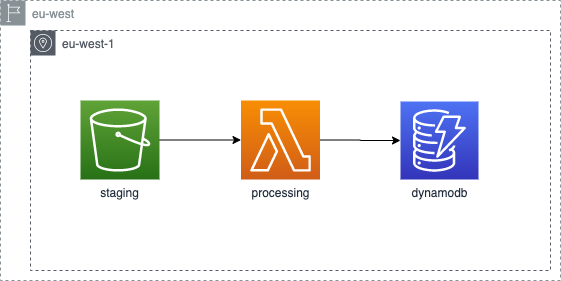

# Terraform demo with AWS

This is a demo for an internal presentation about how to work with Terraform
to write configuration files to provision infrastructure (IaaS).

The demo showcases a couple of the main principles of Terraform:

* [Folder 1](/1_basics): the basics:
    * Setup Terraform
    * Work with the CLI
    * Configure provider (AWS in this case)
    * Create your first resources
* [Folder 2](/2_variables): variables:
    * Adding variables
    * Store variables to a separate file
* [Folder 3](/3_split_setup): split your setup
    * Break down the setup in multiple files
* [Folder 4](/4_modules): modules
    * Create a module for the Lambda function

## Demo project

The idea of the project is to setup a data pipeline where sensor
data will be uploaded to S3 in jsonlines format. Ones a new file has
been uploaded, a Lambda function will be triggered to load the data
into a DynamoDB table.

Although this might seem like a straightforward pipeline, it involves
quite some resources:

* S3 bucket
* S3 bucket notification
* DynamoDB table
* Lambda function
* Lambda IAM role
* Lambda IAM policie
* CloudWatch logging group

## Test your setup

Once you have successfully deployed your infrastructure, you can test
it by uploading the example jsonlines file in the `example_data` folder
to your S3 bucket. This should trigger the Lambda function and insert
the content of the file to the DynamoDB table.
